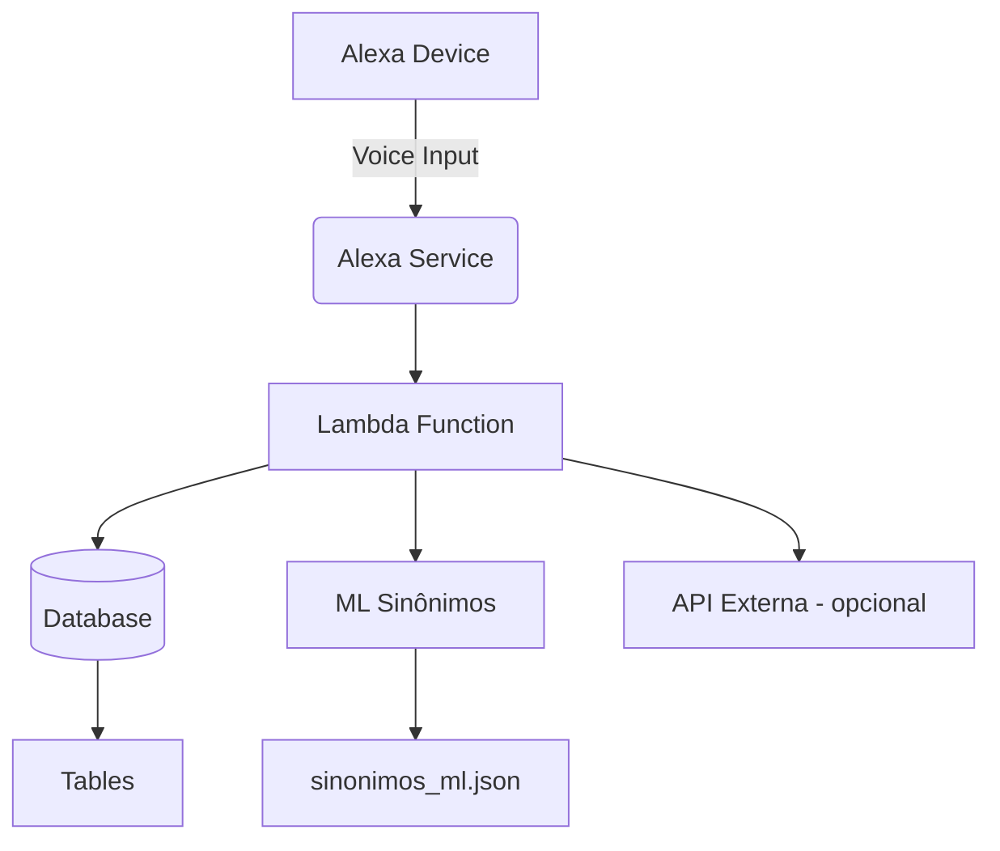
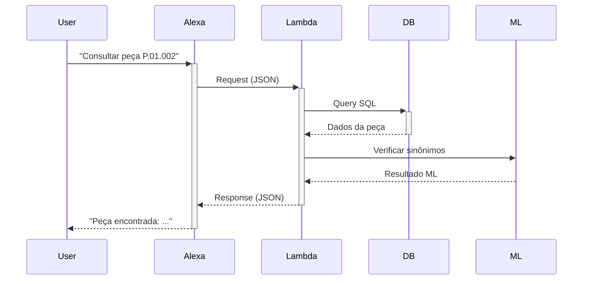
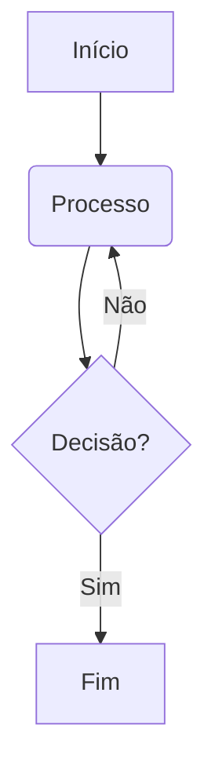
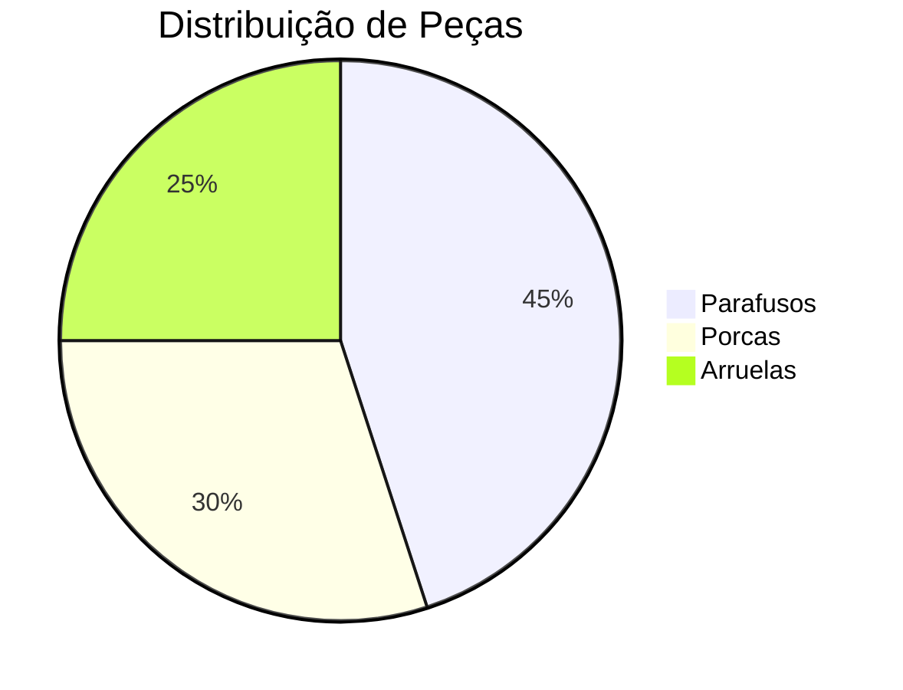

# Estrutura Visual do Projeto de Integração Alexa + Banco de Dados

Aqui está a organização gráfica dos arquivos e componentes do seu projeto:

## 📁 Estrutura de Diretórios (Tree View)

```
alexa-pecas-db/
├── 📁 alexa_skill/
│   ├── 📄 interaction_models/
│   │   ├── 📄 pt-BR.json (modelo de interação)
│   │   └── 📄 custom_slot_types/
│   │       ├── 📄 tipos_pecas.txt
│   │       └── 📄 categorias_equipamentos.txt
│   ├── 📄 skill.json (configuração da skill)
│   └── 📄 lambda/
│       ├── 📄 main.py (função principal)
│       └── 📄 requirements.txt
│
├── 📁 backend/
│   ├── 📄 database/
│   │   ├── 📄 models.py (definição das tabelas)
│   │   ├── 📄 queries.py (consultas SQL)
│   │   └── 📄 conn.py (conexão com DB)
│   ├── 📄 ml/
│   │   ├── 📄 sinonimos_ml.json (arquivo de sinônimos)
│   │   ├── 📄 train_sinonimos.py (treinamento do modelo)
│   │   └── 📄 similarity_model.h5 (modelo treinado)
│   └── 📄 api/
│       ├── 📄 app.py (API REST opcional)
│       └── 📄 endpoints.py
│
├── 📁 docs/
│   ├── 📄 arquitetura.drawio (diagrama)
│   └── 📄 user_flows.md
│       └──📁 Readme/
|           ├──📄 prompt.md
|           ├──📄 user_flows.md
|           └──📁 Estrutura Base/
|               └──📄 Topologia.md
|
└── 📄 README.md
```

## 🔧 Diagrama de Componentes



## 📋 Fluxo de Desenvolvimento Passo a Passo

1. **Configuração Inicial**:
   ```bash
   mkdir alexa-pecas-db
   cd alexa-pecas-db
   git init
   mkdir -p alexa_skill/{interaction_models/custom_slot_types,lambda}
   mkdir -p backend/{database,ml,api}
   mkdir docs
   ```

2. **Banco de Dados**:
   - Crie o arquivo `backend/database/models.py`:
   ```python
   from sqlalchemy import create_engine, Column, String, Integer, ForeignKey
   from sqlalchemy.ext.declarative import declarative_base

   Base = declarative_base()

   class Categoria(Base):
       __tablename__ = 'categorias'
       id = Column(String(20), primary_key=True)
       nome = Column(String(100))
       pai_id = Column(String(20), ForeignKey('categorias.id'))
       nivel = Column(Integer)
   ```

3. **Arquivo de Sinônimos ML**:
   - Crie `backend/ml/sinonimos_ml.json` com:
   ```json
   {
       "sinonimos": {
           "P.01.001": {
               "base": "parafuso sextavado",
               "variacoes": []
           }
       },
       "config": {
           "limiar_aceitacao": 0.7
       }
   }
   ```

4. **Lambda Function**:
   - `alexa_skill/lambda/main.py`:
   ```python
   from flask import Flask, jsonify
   app = Flask(__name__)

   @app.route('/alexa', methods=['POST'])
   def handle_alexa():
       # Implementar handler da Alexa aqui
       return jsonify({"version": "1.0"})
   ```

## 🔄 Fluxo de Dados



## 🛠️ Ferramentas Recomendadas

1. **Desenvolvimento**:
   - [Alexa Skills Kit SDK](https://developer.amazon.com/alexa/alexa-skills-kit)
   - [AWS SAM CLI](https://aws.amazon.com/serverless/sam/) (para deploy Lambda)
   - [SQLAlchemy](https://www.sqlalchemy.org/) (ORM para DB)

2. **Testes**:
   - [Alexa Simulator](https://developer.amazon.com/alexa/console/ask)
   - [Postman](https://www.postman.com/) (testar API)
   - [pgAdmin](https://www.pgadmin.org/) (gerenciar PostgreSQL)

3. **ML**:
   - [scikit-learn](https://scikit-learn.org/) (similaridade de texto)
   - [spaCy](https://spacy.io/) (NLP para melhorar sinônimos)

## 🚀 Próximos Passos Recomendados

1. Implemente o arquivo `interaction_models/pt-BR.json` com seus intents
2. Configure a conexão com o banco em `backend/database/conn.py`
3. Desenvolva o handler principal no Lambda
4. Teste via simulador com os casos de uso principais
5. Implemente o ciclo de aprendizado de máquina

Quer que eu gere algum arquivo específico completo ou explique algum componente com mais detalhes?

---

# Diferença entre Mermaid e Markdown

Markdown e Mermaid são linguagens de marcação, mas servem para propósitos bastante diferentes:

## 📝 Markdown
**O que é**: Linguagem de marcação simples para formatação de texto.

**Principais características**:
- Sintaxe minimalista e fácil de aprender
- Foco em documentação e formatação de texto
- Convertível para HTML e outros formatos
- Padrão amplamente adotado

**Exemplo básico**:
```markdown
# Título Principal
## Subtítulo

- Item de lista
- Outro item

**Negrito** e *itálico*
```

## 🧜 Mermaid
**O que é**: Linguagem para criação de diagramas e visualizações baseada em texto.

**Principais características**:
- Especializada em diagramação (fluxogramas, sequência, etc.)
- Sintaxe específica para cada tipo de diagrama
- Renderização visual complexa a partir de texto simples
- Menos difundido que Markdown

**Exemplo básico**:


## Comparação Detalhada

| Característica          | Markdown                           | Mermaid                          |
|-------------------------|------------------------------------|----------------------------------|
| **Propósito principal** | Formatação de texto                | Criação de diagramas             |
| **Sintaxe**             | Simples, para texto                | Específica para tipos de diagrama|
| **Onde funciona**       | Qualquer editor MD                 | Requer renderizador compatível   |
| **Extensão de arquivo** | .md ou .markdown                   | Normalmente embutido em MD       |
| **Elementos típicos**   | Títulos, listas, tabelas, links    | Nós, setas, caixas, conexões     |
| **Uso em plataformas**  | GitHub, GitLab, blogs, etc.        | GitHub, GitLab (com suporte), docs técnicos |

## Integração entre eles

Mermaid pode ser usado **dentro** de arquivos Markdown em plataformas que suportam ambos:

````markdown

````

## Quando usar cada um

**Use Markdown quando**:
- Precisa documentar algo principalmente em texto
- Quer criar READMEs, documentação simples
- Precisa de compatibilidade máxima com plataformas

**Use Mermaid quando**:
- Precisa explicar fluxos, arquiteturas ou relações
- Quer incluir diagramas diretamente na documentação
- Trabalha em ambientes que suportam sua renderização

## Suporte em Plataformas

- **GitHub**: Suporta ambos nativamente
- **GitLab**: Suporta ambos nativamente
- **VS Code**: Requer extensões para visualização de Mermaid
- **Obsidian**: Suporta ambos com plugins

Mermaid está se tornando cada vez mais popular para documentação técnica, especialmente quando combinado com Markdown em ferramentas modernas de desenvolvimento.